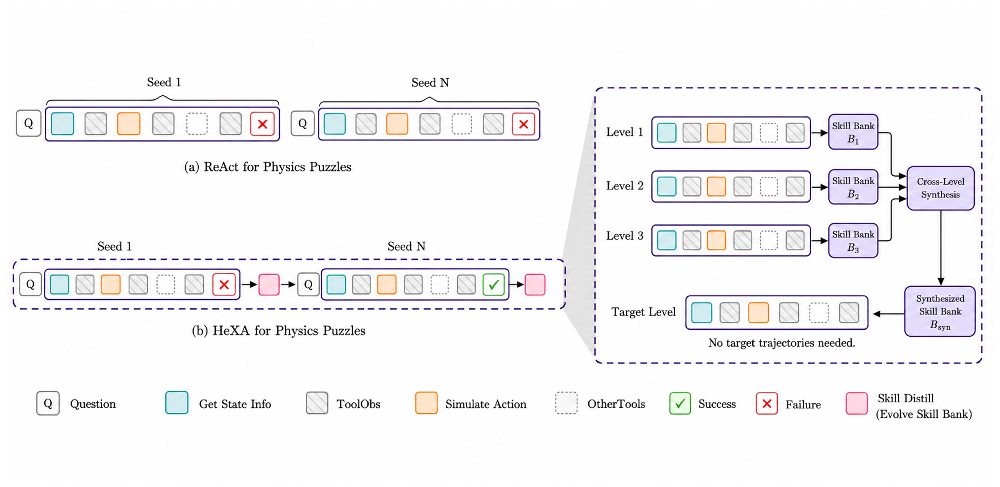

# HeXA Project Page

Static site for the **Hierarchical Experimentalist Agents** paper.

No framework, no build step. Just HTML + CSS.

## Files

```
.
├── index.html      # All content
├── style.css       # All styling
├── assets/         # (create when you have images) teaser.png, paper.pdf, ...
└── README.md
```

## Deploy to GitHub Pages — 3 steps

1. Drop `index.html`, `style.css`, `README.md` at the **root** of your repo and push:
   ```bash
   git add index.html style.css README.md
   git commit -m "Initial project page"
   git push
   ```

2. Repo → **Settings** → **Pages** → Source: *Deploy from a branch*, Branch: `main`, Folder: `/ (root)`. Save.

3. Wait ~30s. Site goes live at:
   ```
   https://<your-username>.github.io/<repo-name>/
   ```

## Customize — where to edit what

Everything is in `index.html`. Search for these landmarks:

| Want to change…                  | Find this in `index.html`                                |
|----------------------------------|-----------------------------------------------------------|
| Paper / Code links               | `<div class="links">` — replace each `href="#"`          |
| Authors and author links         | `<div class="authors">`                                  |
| Affiliations                     | `<div class="affiliations">`                             |
| Venue line ("Under review at…")  | `<div class="venue">`                                    |
| Subtitle / one-liner             | `<h2 class="subtitle">`                                  |
| Abstract / Method / Results text | The three `<section class="section">` blocks             |
| BibTeX                           | The `<pre><code>` block at the bottom                    |
| Accent colour (link blue)        | `style.css` → change `--link` and `--link-hover`         |

## Add your teaser figure

1. Make an `assets/` folder next to `index.html`.
2. Drop in `teaser.png` (1600–2000px wide; export Figure 1 from the paper).
3. In `index.html`, replace the entire `<div class="placeholder-figure">…</div>` block with:
   ```html
   
   ```

## Add the PDF

1. Drop `assets/paper.pdf` (or use an arXiv URL directly).
2. Update the Paper button's `href`:
   ```html
   <a class="link-button" href="assets/paper.pdf" target="_blank" rel="noopener">
   ```

## Local preview

```bash
python3 -m http.server 8000
# then open http://localhost:8000
```

(Or just double-click `index.html` — works fine for previewing.)
